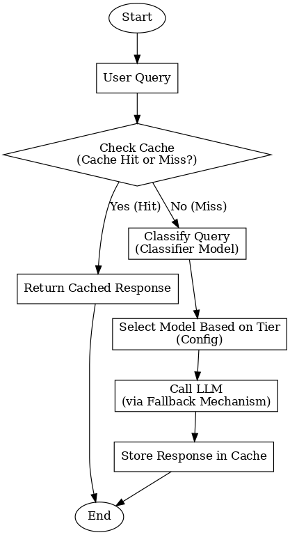
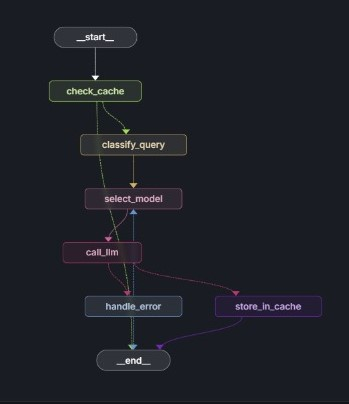
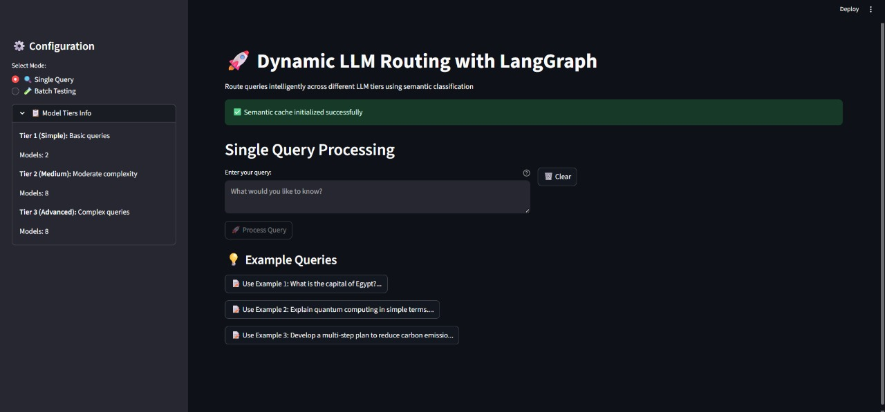
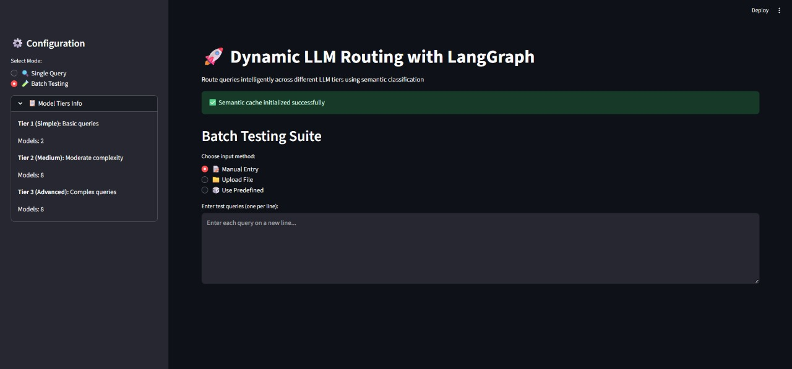
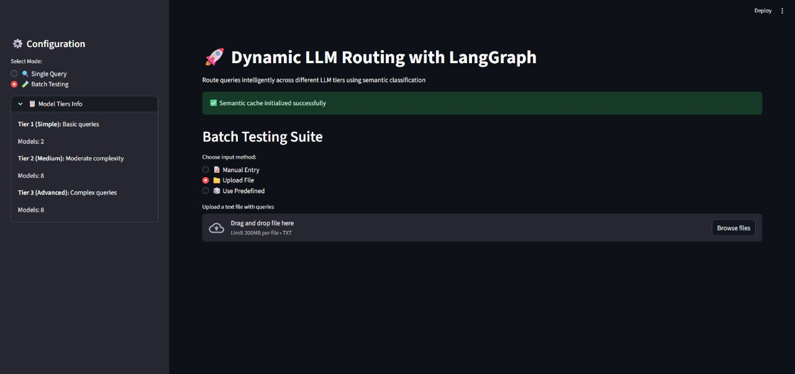
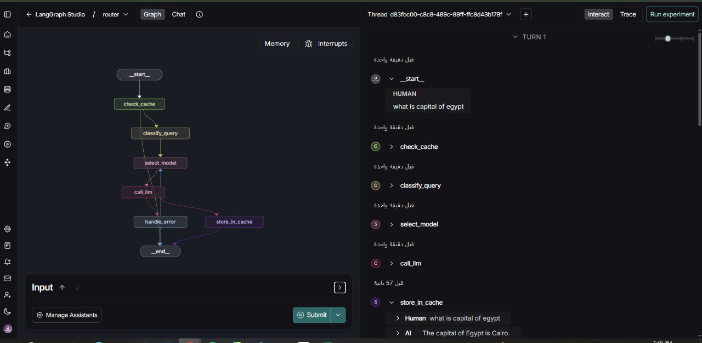

# Dynamic LLM Routing System

<div align="center">

[](https://python.org)
[](https://langchain.com/langgraph)
[](https://streamlit.io)

**An intelligent query routing system that dynamically selects the most appropriate Large Language Model based on query complexity and requirements.**

[🏗️ System Architecture](#system-architecture) • [🚀 Usage](#usage) • [📊 Performance Analysis](#performance-analysis) • [🔮 Future Improvements](#future-improvements)

</div>

---

## Project Overview

### Problem Statement

Traditional LLM applications use a single powerful model for all queries, leading to:
- **Inefficient resource usage**: 70% of queries could be handled by cheaper models
- **High operational costs**: $0.03 per request regardless of complexity
- **Unnecessary latency**: 2-4 second delays for simple factual queries
- **Poor cost scalability**: Fixed high costs that don't match query value

### Solution Architecture

A dynamic routing system that classifies queries and routes them to appropriate model tiers based on complexity, implementing semantic caching and robust fallback mechanisms with an intuitive Streamlit interface.

---

## System Architecture

## Flowchart


### LangGraph Workflow

The system implements a sophisticated LangGraph-based workflow for intelligent query routing:


*LangGraph Studio visualization of the routing workflow*

### Core Components

| Component | Technology | Responsibility |
|-----------|------------|----------------|
| **Router** | LangGraph | Orchestrates workflow execution |
| **Classifier** | Transformers | Analyzes query complexity (S/M/A) |
| **Cache** | Sentence-BERT | Semantic similarity matching (0.90 threshold) |
| **Fallback** | Custom Logic | Handles failures across model tiers |
| **Config** | Pydantic | Environment-based settings management |
| **UI** | Streamlit | Interactive web interface |


---

## User Interface

### Streamlit Web Interface

The system includes an intuitive Streamlit-based GUI for easy interaction:


*Main interface for query input and model selection*






### LangGraph Studio Integration


*Real-time workflow execution in LangGraph Studio*

---

## Performance Analysis

### Experimental Setup

**Data Source**: `test_results/test_results.xlsx` generated by `test_suite.py`

**Current Run Size**: 16 queries

**Scope Note**: These are direct measurements from the latest local run only (not a long-horizon benchmark).

### Direct Performance Comparison

| Metric | Current `test_suite` Result |
|--------|------------------------------|
| **Queries Evaluated** | 16 |
| **Average Cost per Query** | $0.000181 |
| **Average Response Time** | 7.8406s |
| **Cache Hit Rate** | 37.5% (6/16) |

### Detailed Performance Breakdown

**Observed Route Distribution**:
```
cache: 6
M: 4
S: 3
A: 3
```

**Observed Top Used Models**:
- `cache`: 6
- `openai/gpt-oss-20b:free`: 4
- `meta-llama/llama-3.3-8b-instruct:free`: 3
- `qwen/qwen-2.5-coder-32b-instruct:free`: 3

### Cost Analysis

This run reports measured per-query cost directly from model responses.
No fixed monthly projection is included in the current code path.

### Quality Impact Analysis

Current `test_suite.py` does not compute answer correctness/accuracy metrics.
For quality scoring, add a ground-truth dataset and a judging stage.

---

## Technical Implementation

### Project Structure

```
Dynamic-LLM-Routing-System/
│
├── BERT_LAST_V.ipynb           # Jupyter notebook for BERT model training & experiments
├── main.py                     # Main entry point for the application
├── streamlit_app.py            # Streamlit web UI for interactive query routing
├── test_suite.py               # Comprehensive test suite for system evaluation
├── environment.yml             # Conda environment dependencies
├── README.md                   # Project documentation (this file)
│
├── core/                       # Core system components
│   ├── __init__.py             # Package initialization
│   ├── classifier.py           # Query complexity classification logic
│   ├── fallback.py             # Model fallback and retry mechanisms
│   ├── langgraph_router.py     # LangGraph-based routing workflow
│   └── semantic_cache.py       # Semantic caching with similarity matching
│
├── config/                     # Configuration management
│   ├── __init__.py             # Package initialization
│   ├── config.py               # Model tiers & system configuration
│   └── logger_config.py        # Logging configuration
│
├── best_model/                 # Fine-tuned BERT classifier model
│   ├── config.json             # Model configuration
│   ├── model.safetensors       # Model weights (267MB)
│   ├── tokenizer.json          # Tokenizer vocabulary
│   ├── tokenizer_config.json   # Tokenizer configuration
│   ├── special_tokens_map.json # Special tokens mapping
│   └── vocab.txt               # Vocabulary file
│
├── LangSmith_Studio/           # LangGraph Studio development environment
│   ├── langgraph.json          # Studio configuration
│   ├── studio_graph.py         # Studio-specific graph implementation
│   ├── semantic_cache.json     # Cached semantic query results
│   ├── .env                    # Environment variables (API keys)
│   └── .langgraph_api/         # Studio API cache
│
├── assets/                     # Documentation images and diagrams
│   ├── LangGraph.jpeg          # LangGraph workflow visualization
│   ├── LangGraph1.jpeg         # Alternative workflow view
│   ├── LLM_Router_Flowchart.png # System flowchart diagram
│   ├── streamlit1.jpeg         # Streamlit UI screenshots
│   ├── streamlit2.jpeg
│   └── streamlit3.jpeg
│
├── run_doc/                    # Runtime documentation and screenshots
│   ├── Chat_Langgraph_studio.png
│   ├── Graph_Langgraph_studio.png
│   └── ...
│
└── test_results/               # Cached query results for testing

```

### Key Implementation Details

**Classification Algorithm**:
```python
def classify_query(query: str) -> str:
    # Uses fine-tuned BERT model trained on complexity-labeled dataset
    # Features: intent keywords, length, complexity indicators, domain specificity
    # Returns: "S" (Simple), "M" (Medium), "A" (Advanced)
    prediction = self.model(query)
    return prediction.label
```

**Semantic Cache**:
- Uses sentence-transformers (all-MiniLM-L6-v2)
- Similarity threshold: 0.90 (precision-first matching)
- Average lookup time: 50ms
- Storage: JSON file with vector embeddings

**Fallback Strategy**:
- Tier 1: 3 models with 2-second timeout each
- Tier 2: 4 models with 3-second timeout each  
- Tier 3: 3 models with 5-second timeout each
- Cross-tier fallback: If all models in tier fail, escalate to next tier

---

## Usage

### Installation

```bash
git clone <repository-url>
cd llm-router-system
python -m venv llamaIndex-env
source llamaIndex-env/bin/activate
pip install -r requirements.txt
```

### Environment Configuration

```env
# API Keys for different model providers
OPENAI_API_KEY=your_key_here
mistral-7b-instruct=your_openrouter_key
qwen-2.5-72b-instruct=your_openrouter_key
llama-3.3-8b-instruct=your_openrouter_key
# ... additional model keys

# System Configuration
ENVIRONMENT=production
CACHE_TTL_SECONDS=3600
MAX_FALLBACK_ATTEMPTS=3
REQUEST_TIMEOUT=60
```

### Running the System

#### Streamlit Web Interface
```bash
streamlit run streamlit_app.py
```

#### Command Line Interface
```python
from core import Router, SemanticCache
from config import MODELS_CONFIG, Classifier, LLMClient

# Initialize components
cache = SemanticCache(default_ttl=3600)
classifier = Classifier()
llm_client = LLMClient(MODELS_CONFIG)
router = Router(
  models_config={k: [m[1] for m in v] for k, v in MODELS_CONFIG.items()},
  cache=cache,
  classifier=classifier,
  llm_client=llm_client,
)

# Process query
def process_query():
    result = router.route("Explain machine learning in simple terms")
    print(f"Classification: {result['classification']}")
    print(f"Used Model: {result['used_model']}")
    print(f"Response: {result['llm_response']}")

process_query()
```

#### LangGraph Studio
```bash
langgraph dev
```

### Testing

```bash
# Run comprehensive performance tests
python test_suite.py

# Test individual components
python core/classifier.py  # Test classification
python core/semantic_cache.py  # Test caching
python core/fallback.py  # Test model fallbacks
```

---

## Future Improvements

### Priority Enhancements

**1. Adaptive Classification Thresholds**
- Dynamic threshold adjustment based on real-time accuracy feedback
- Estimated 15% improvement in classification accuracy

**3. Multi-Dimensional Routing**
- Add domain expertise and response time requirements as routing factors
- More nuanced routing decisions based on query characteristics

### Target Performance Improvements
- **Cost Reduction**: increase savings based on larger benchmark runs
- **Classification Quality**: add validated accuracy pipeline with ground truth
- **Cache Hit Rate**: improve cache reuse on repeated workloads

---

